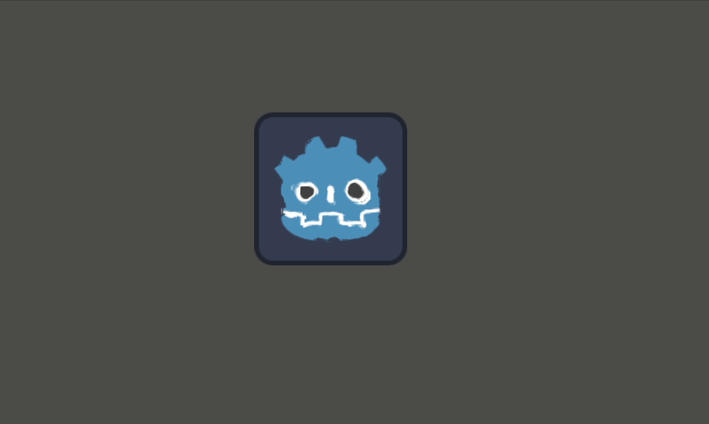

# Shaders XP

Petite collection de shaders Godot (`canvas_item`) expérimentaux.

## Arborescence

```
.
├── color_shader/
│   └── colorShader.gdshader
├── fog_shader/
│   └── fogShader.gdshader
└── water_shader/
    └── waterShader.gdshader
```

## Color Shader


Fait pulser une teinte sur la texture au cours du temps.

**Uniforms**
- `color` : la teinte à appliquer.
- `mix_amount` : force max du mélange entre la texture et `color` (0 = pas d'effet, 1 = full couleur).

**Fonctionnement**
`sin(TIME)` oscille entre -1 et 1, multiplié par `mix_amount` ça donne `final_mix`. Tant que `final_mix > 0`, on mélange la texture avec `color` via `mix()` — l'oscillation du sinus fait donc apparaître/disparaître la teinte en boucle. Quand `final_mix` est négatif (moitié du cycle), on garde la texture d'origine.

## Fog Shader


Simule un brouillard animé qui se déplace sur la texture.

**Uniforms**
- `noise` : texture de bruit utilisée pour générer le brouillard.
- `color` : couleur du brouillard (utilisée indirectement via `noise_color`).
- `mix_amount` : proportion de brouillard mélangé à la texture finale.
- `speed` : vitesse de déplacement du brouillard.

**Fonctionnement**
1. **Warp** : on échantillonne le bruit une première fois (`warp`) pour obtenir des valeurs aléatoires par pixel, décalées dans le temps. On recentre ces valeurs autour de 0 (`-0.5`) puis on réduit leur amplitude (`* 0.3`) pour ne pas trop déformer.
2. On relit le bruit une seconde fois, mais en décalant les UV avec `warp` + un mouvement sinusoïdal (`sin`/`cos` du temps, scalé par `speed`) : ça donne un bruit qui "coule" au lieu d'être statique.
3. Ce `noise_color` est ensuite mélangé à la texture d'origine selon `mix_amount` pour donner le rendu final.

## Water Shader



Fait "fondre"/onduler la texture localement autour d'une couleur ciblée.

**Uniforms**
- `noise` : texture de bruit pour la distorsion.
- `color_picked` : couleur cible autour de laquelle l'effet se déclenche.
- `amount` : intensité max de la distorsion.
- `melt_range` : distance de recherche (en UV) autour du pixel pour détecter `color_picked`.

**Fonctionnement**
1. `melt_factor()` scanne autour du pixel courant (haut/bas/gauche/droite, pas à pas jusqu'à `melt_range`) pour voir si `color_picked` est proche. Plus elle est trouvée tôt (proche), plus le facteur retourné est élevé (1.0 = pile dessus, 0.0 = hors de portée).
2. Ce facteur sert à pondérer une distorsion des UV basée sur un bruit animé (`noise` échantillonné avec un décalage sinusoïdal du temps).
3. Résultat : les pixels proches de `color_picked` sont déplacés (effet de fonte), les pixels loin de cette couleur restent inchangés.

---

> Note : si les gifs de démo semblent saccadés, c'est parce qu'ils ont été enregistrés avec Peek, qui a fortement impacté les performances pendant la capture.
